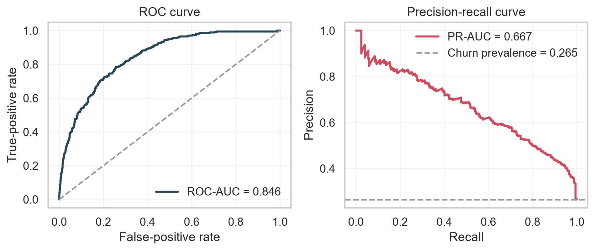
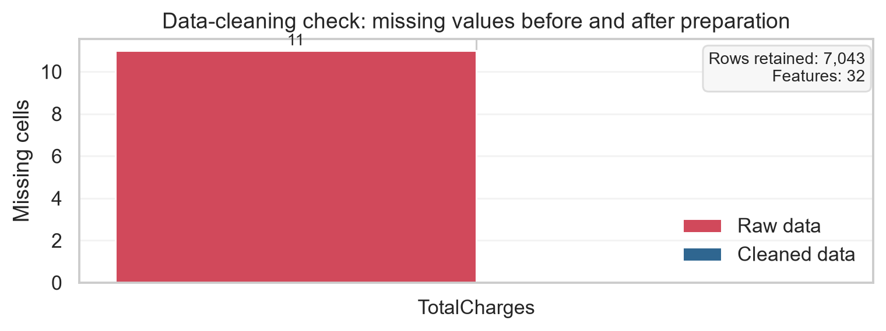
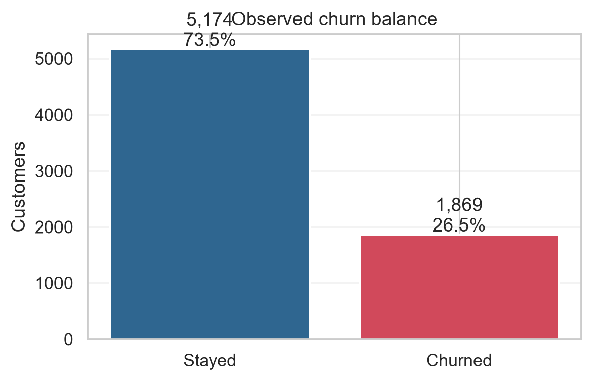
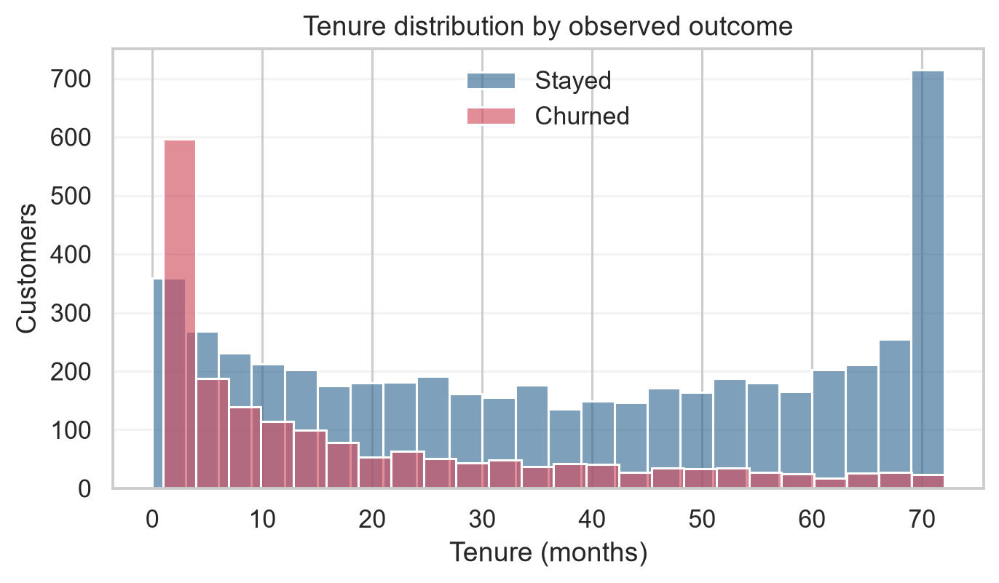
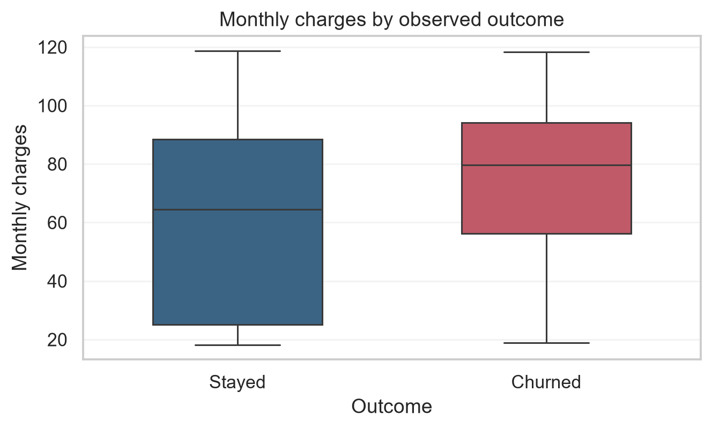
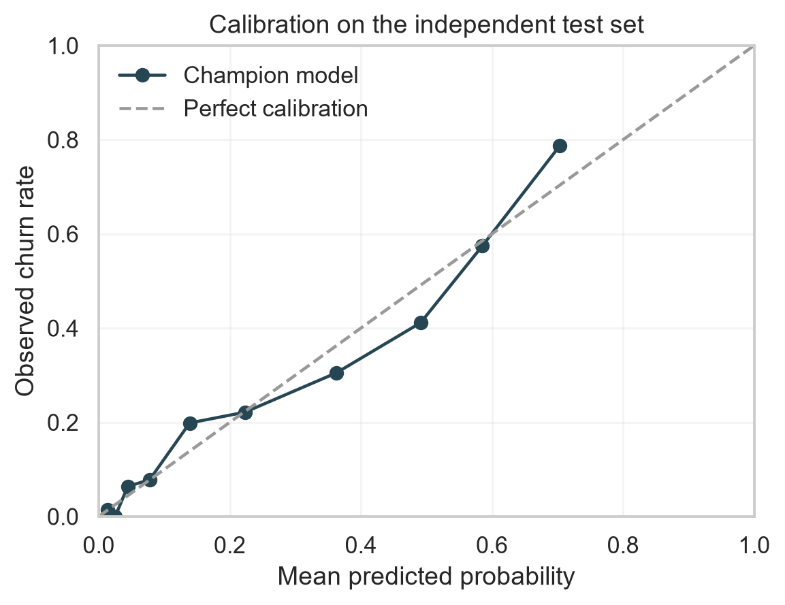
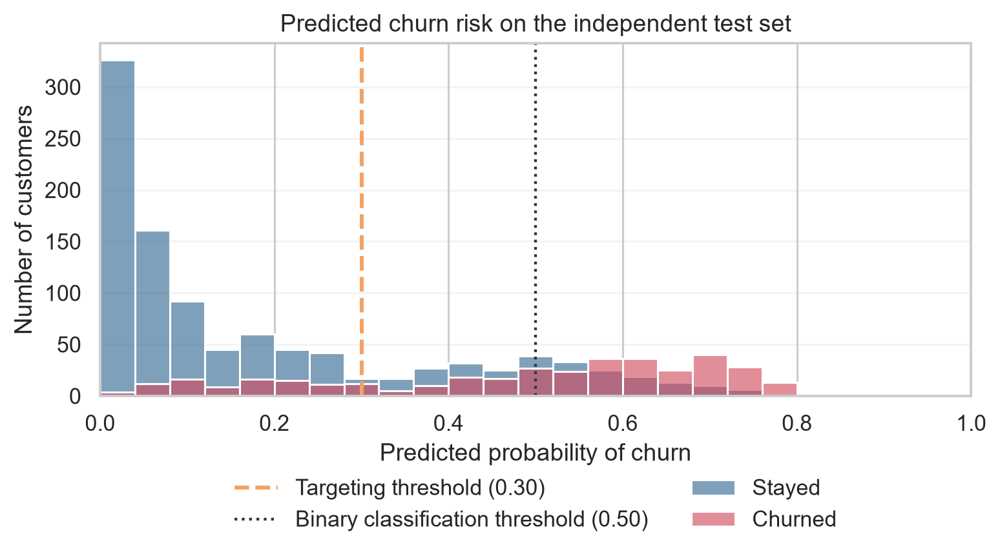
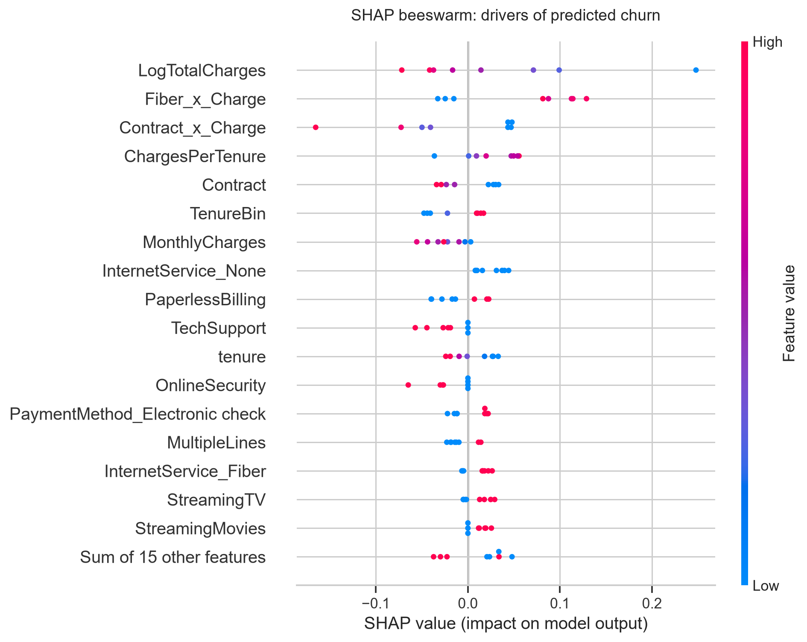
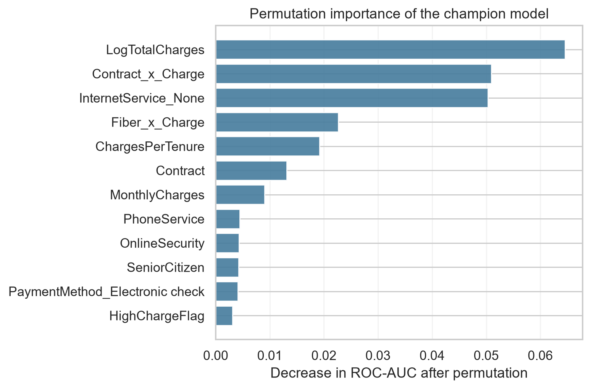
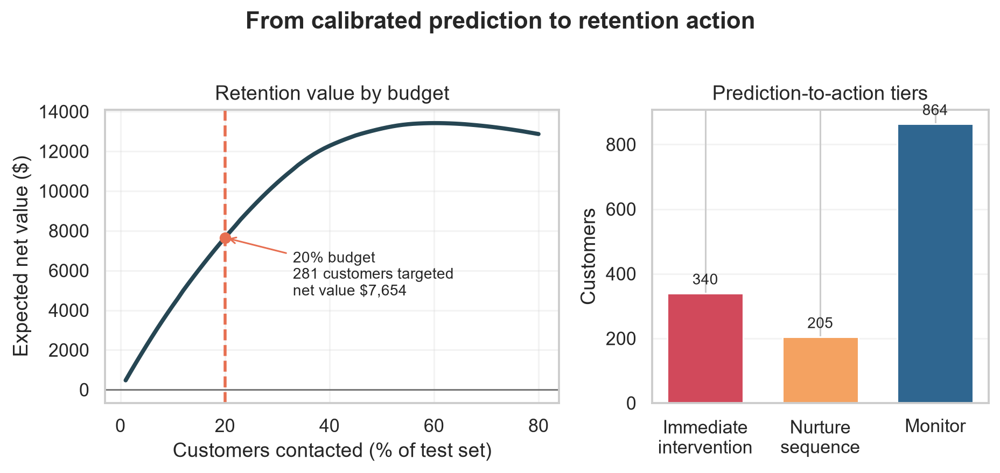

# TCCP  Trustworthy Customer Churn Prediction

An end-to-end machine-learning project that turns customer data into reliable churn probabilities, understandable explanations, and retention actions that respect a limited budget.



## The problem

Customer churn is more than a binary classification task. A retention team needs to know:

- Which customers are most likely to leave?
- How reliable is each predicted probability?
- What factors are driving the risk score?
- Which customers should be contacted first when the campaign budget is limited?

TCCP separates prediction from action. The model estimates a customer's probability of churn, then the retention policy ranks customers by expected value:

```text
expected net value = churn probability × save rate × customer value − contact cost
```

This makes the trade-off visible instead of treating a model's default 0.50 threshold as a business decision.

## Results at a glance

The champion model is a calibrated RBF Support Vector Classifier selected by validation PR-AUC.

| Metric | Result |
| --- | ---: |
| Validation PR-AUC | 0.670 ± 0.019 |
| Test ROC-AUC | 0.846 ± 0.011 |
| Test PR-AUC | 0.667 ± 0.025 |
| Test Brier score | 0.137 ± 0.005 |
| Final test accuracy at threshold 0.30 | **75.5%** |
| Test balanced accuracy | 0.759 |

At a demonstration contact budget of 20%, the simulation targets 281 customers and estimates approximately **$7,654** in net value. This is a scenario estimate based on assumed save rate, customer value, and contact cost—not measured causal revenue.

### Accuracy by decision threshold

| Decision threshold | Test accuracy | Balanced accuracy | Recall | Customers flagged |
| ---: | ---: | ---: | ---: | ---: |
| `0.30` — retention targeting | **75.5%** | 75.9% | 76.7% | 38.7% |
| `0.50` — standard classification | **79.3%** | 72.0% | 56.4% | 24.1% |
| `0.60` — standard classification | **80.1%** | 66% |  | 24.% |

The `0.30` threshold catches more potential churners, while `0.50` gives higher overall accuracy by flagging fewer customers. The retention workflow therefore uses `0.30` for prioritization rather than relying on accuracy alone.

## Dataset

The project uses the IBM Telco Customer Churn dataset, supplied in this repository as `data/telco.csv`.

| Property | Description |
| --- | --- |
| Observations | 7,043 telecom customers |
| Target | `Churn` — `1` for churn, `0` for staying |
| Raw identifier | `customerID`, excluded from training |
| Main customer data | Demographics, tenure, services, contract, billing, and charges |
| Raw data issue | 11 whitespace values in `TotalCharges` |
| Cleaned data | `data/telco_clean_32col.csv` |
| Model features | 32 engineered and encoded columns |

Preparation includes numeric coercion, missing-value imputation, categorical encoding, scaling, and feature engineering. Engineered features include service count, tenure bins, charge interactions, charge-per-tenure, log charges, and a new-customer flag.

## Approach

1. Clean and validate the raw customer records.
2. Split the data into an 80/20 stratified train/test split using seed `42`.
3. Tune five candidate models with five-fold validation.
4. Select using validation PR-AUC because churn is an imbalanced positive class.
5. Calibrate probabilities with five-fold sigmoid calibration.
6. Evaluate once on the independent test set.
7. Explain model behaviour with SHAP, partial dependence, and permutation importance.
8. Convert scores into risk tiers and budget-aware retention actions.
9. Register, batch-score, and serve the champion model through local or Databricks-ready interfaces.

### Models compared

- Elastic-net Logistic Regression
- RBF Support Vector Classifier
- Random Forest
- XGBoost
- PyTorch Multilayer Perceptron

## Visual results

### Data quality and customer behaviour

| Data quality | Churn balance |
| --- | --- |
|  |  |

| Tenure distribution | Monthly charges |
| --- | --- |
|  |  |

### Model reliability and explainability

| Calibration | Predicted risk |
| --- | --- |
|  |  |

| SHAP summary | Feature importance |
| --- | --- |
|  |  |

### From prediction to retention action



The demonstration policy uses these tiers:

| Tier | Risk rule | Test accuracy at threshold | Suggested action |
| --- | --- | ---: | --- |
| Immediate intervention | `p >= 0.50` | 79.3% | High-touch retention offer or priority call |
| Nurture sequence | `0.30 <= p < 0.50` | 75.5% at campaign threshold | Targeted message, service review, or incentive test |
| Monitor | `p < 0.30` | — | Standard service and drift monitoring |

## Repository structure

```text
.
├── data/                 Raw and cleaned Telco churn data
├── artifacts/            Trained models, metadata, and benchmark results
├── figures/              Generated charts used in the report and README
├── notebooks/            Reproducible analysis workflow
├── reports/              Technical paper and report outputs
├── src/                  Training, scoring, explainability, and serving code
├── models/registry/      Versioned local model registry
├── Dockerfile            Container image for the API
├── docker-compose.yml    Local API deployment
└── requirements.txt      Python dependencies
```

## Quick start

### Install

```bash
python -m venv .venv

# Windows PowerShell
.venv\Scripts\Activate.ps1

# macOS/Linux
# source .venv/bin/activate

python -m pip install --upgrade pip
pip install -r requirements.txt
```

### Reproduce the analysis

Run the notebooks in order:

| Notebook | Purpose |
| --- | --- |
| `00_project_guide.ipynb` | Project overview and exploratory charts |
| `01_data_cleaning.ipynb` | Cleaning and feature engineering |
| `02_model_training.ipynb` | Benchmarking, calibration, and production artifact |
| `03_calibration.ipynb` | Brier score and reliability analysis |
| `04_shap_analysis.ipynb` | Global and local model explanations |
| `05_retention_simulation.ipynb` | Budget-based customer targeting |
| `06_threshold_optimization.ipynb` | Threshold and accuracy-recall trade-offs |
| `07_model_evaluation_visuals.ipynb` | Evaluation and publication-ready visuals |

Figures can also be regenerated with:

```bash
python -m src.decision_visuals
```

## Batch scoring

Register a model version and promote it to the local `production` stage:

```bash
python -m src.register_model --version v1.0.0 --promote
```

Score a CSV file in batches:

```bash
python -m src.batch_score \
  --input data/telco_clean_32col.csv \
  --output artifacts/scored_customers.csv
```

The output contains `predicted_churn_probability` and `predicted_churn`.

## API service

Start the API locally after a production model has been registered:

```bash
uvicorn src.serve:app --reload
```

Useful endpoints:

- `GET /health` — service and model status
- `GET /metadata` — active model metadata and feature contract
- `POST /predict` — score one to 10,000 customer records
- `GET /docs` — interactive OpenAPI documentation

Example request:

```bash
curl -X POST https://tccp-imy8.onrender.com/predict \
  -H "Content-Type: application/json" \
  -d '{"records":[{"tenure":12,"MonthlyCharges":75.5,"TotalCharges":906,"Contract":"Month-to-month"}]}'
```

Run the containerized service with:

```bash
docker compose up --build
```

The service is available at `https://tccp-imy8.onrender.com/health`.

## MLOps and deployment

The repository includes a lightweight deployment path:

- Versioned local model registry with production promotion.
- Serialized preprocessing and estimator in the model artifact.
- Batch scoring with a bounded batch size.
- FastAPI health, metadata, and prediction endpoints.
- Docker and Docker Compose configuration.
- GitHub Actions Python validation workflow.
- MLflow and Databricks configuration examples in `MODEL_REGISTRY.md` and `databricks.yml`.

Before production use, validate the model on a time-based holdout, monitor calibration and input drift, check subgroup performance, and replace assumed retention economics with measured intervention outcomes.

## Limitations

The dataset is historical and does not prove future performance or causal treatment effects. SHAP and partial dependence describe the fitted model; they do not prove that changing a feature will prevent churn. The retention simulation uses assumptions for save rate, customer value, and contact cost. These assumptions should be tested through controlled retention experiments.

## Technical paper

The full methodology, data contract, evaluation, explainability discussion, retention policy, and MLOps design are documented in [`reports/mmm.pdf`](reports/mmm.pdf).

## License and attribution

The code is released under the MIT License. Dataset rights remain with the original dataset provider - `https://www.kaggle.com/datasets/blastchar/telco-customer-churn`
**Copyright © 2026 mikiyas zenebe**
